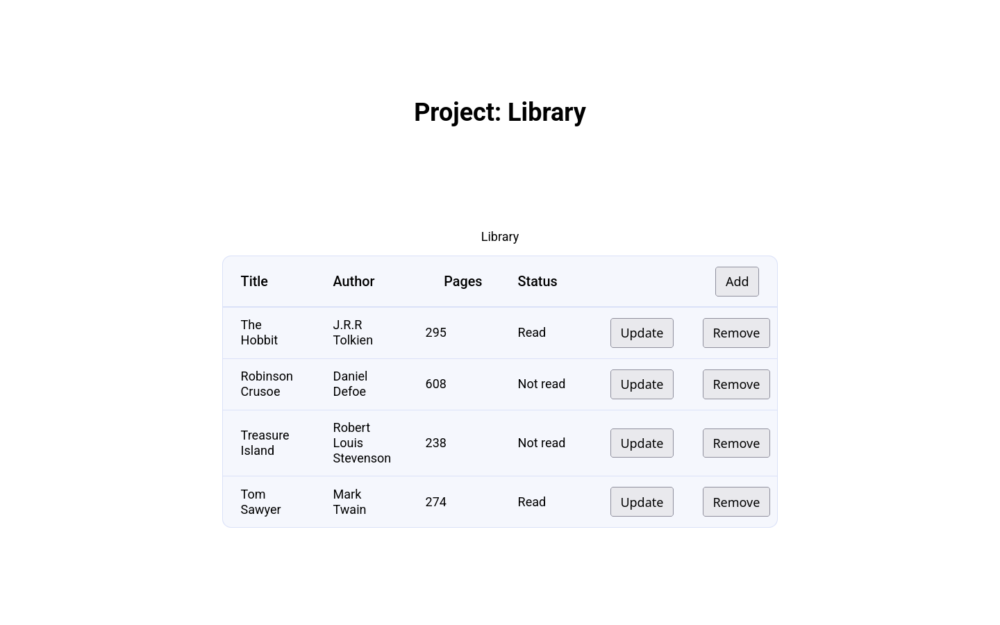

# Project: Library



[Live version](https://matiasbastarrica.github.io/library-top/)

# Introduction

For this project, I will build a small library app.

# Assignment

1. If you haven’t already, set up a Git repository for your project with skeleton HTML/CSS and JS files. From here on out, we’ll assume that you have already done this.

2. All of your book objects are going to be stored in an array, so you’ll need a constructor for books. Then, add a separate function to the script (not inside the constructor) that can take some arguments, create a book from those arguments, and store the new book object into an array. Also, all of your book objects should have a unique `id`, which can be generated using `crypto.randomUUID()`. This ensures each book has a unique and stable identifier, preventing issues when books are removed or rearranged. Your code should look something like this (we’re showing only a basic skeleton without function parameters):

```
const myLibrary = [];

function Book() {
  // the constructor...
}

function addBookToLibrary() {
  // take params, create a book then store it in the array
}

```

3. Write a function that loops through the array and displays each book on the page. You can display them in some sort of table, or each on their own “card”. It might help for now to manually add a few books to your array so you can see the display.

   1. While it might look easier to manipulate the display of the books directly rather than store their data in an array first, from here forward, you should think of these responsibilities separately. We’ll delve deeper into this concept later, but when developing applications, we want the flexibility to recreate elements (like our library and its books) in various ways using the same underlying data. Therefore, consider the logic for displaying books to the user and the book structures that hold all information as distinct entities. This separation will enhance the maintainability and scalability of your code.

4. Add a “New Book” button that brings up a form allowing users to input the details for the new book and add it to the library: author, title, number of pages, whether it’s been read and anything else you might want. How you decide to display this form is up to you. For example, you may wish to have a form show in a sidebar or you may wish to explore [dialogs and modals](https://developer.mozilla.org/en-US/docs/Web/HTML/Element/dialog) using the `<dialog>` tag. However you do this, you will most likely encounter an issue where submitting your form will not do what you expect it to do. That’s because the `submit` input tries to send the data to a server by default. This is where `event.preventDefault();` will come in handy. Check out the [documentation for event.preventDefault](https://developer.mozilla.org/en-US/docs/Web/API/Event/preventDefault) and see how you can solve this issue!

5. Add a button on each book’s display to remove the book from the library.

   1. You will need to associate your DOM elements with the actual book objects in some way. One easy solution is giving them a `data-attribute` that corresponds to the unique `id` of the respective book object.

6. Add a button on each book’s display to change its `read` status.
   1. To facilitate this you will want to create `Book` prototype function that toggles a book instance’s `read` status.

Note: You’re not required to add any type of storage to save the information between page reloads.
